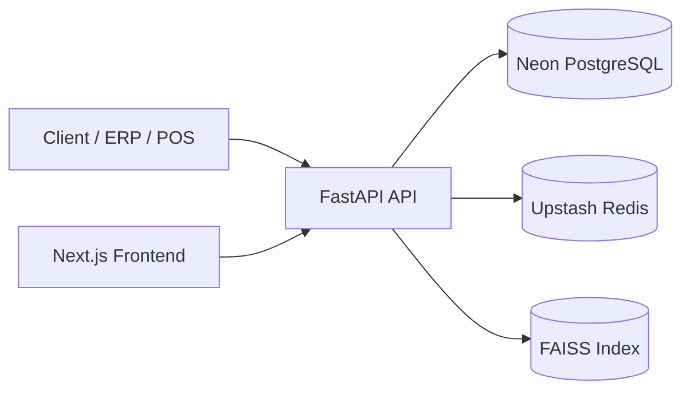

# Architecture

## System Overview

## Data Flow
1. User/API key calls classification endpoints.
2. API runs matcher (verified rows + FAISS semantic fallback).
3. Prediction and audit data are stored in PostgreSQL.
4. Cache and rate-limit counters are stored in Redis.
5. Reports/analytics aggregate from PostgreSQL.

## Tech Stack
| Component | Technology |
|---|---|
| API | FastAPI |
| ORM | SQLAlchemy |
| DB | PostgreSQL (Neon) |
| Cache | Redis (Upstash) |
| Vector search | FAISS |
| Frontend | Next.js |

## Rationale
- FastAPI for fast async APIs and OpenAPI.
- SQLAlchemy for model/migration discipline.
- Redis for low-latency cache and throttling.
- FAISS for fast semantic nearest-neighbor matching.
- Next.js for SSR/SPA hybrid admin UX.

## Deployment Topology
- App runtime: Railway
- Database: Neon PostgreSQL
- Cache: Upstash Redis
